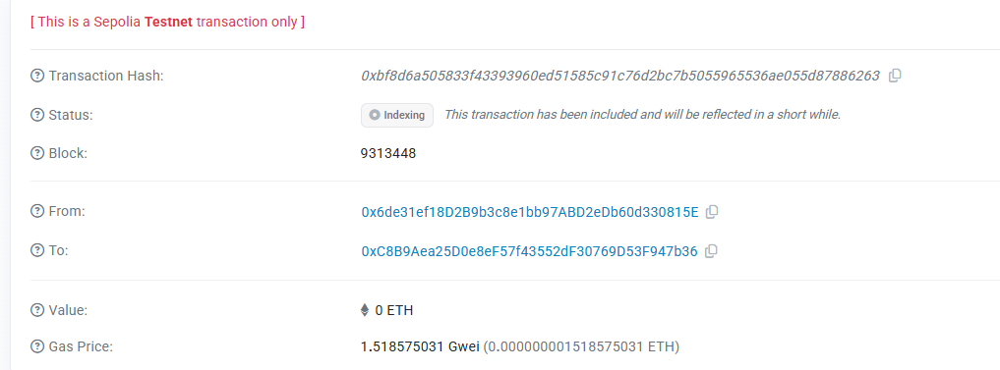

# Cultural Heritage Protection

A decentralized application for secure and private management of cultural artifacts using Fully Homomorphic Encryption (FHE) on blockchain.

## 🌟 Overview

Cultural Heritage Protection is a blockchain-based platform that leverages FHE technology to protect sensitive information about cultural artifacts while maintaining transparency and accessibility. The system enables museums, collectors, and cultural institutions to register, manage, and share artifact data without exposing confidential details such as valuations, authenticity status, and provenance information.

## 🔐 Core Concepts

### Fully Homomorphic Encryption (FHE)

This project implements FHE to enable computations on encrypted data without decryption. Key benefits include:

- **Privacy-First Architecture**: Sensitive artifact data (ID, value, age, authenticity) remains encrypted on-chain
- **Confidential Computations**: Verify authenticity and compare values without revealing actual data
- **Granular Access Control**: Owners can selectively grant decryption rights to authorized viewers
- **Zero-Knowledge Verification**: Expert authentication without exposing proprietary information

### Private Cultural Heritage Data Management

The system addresses critical challenges in cultural heritage management:

1. **Confidential Valuations**: Artifact values remain encrypted, preventing market manipulation
2. **Protected Provenance**: Ownership history tracked without exposing sensitive details
3. **Secure Authentication**: Expert verification without revealing authentication methods
4. **Access Audit Trail**: Complete transparency of who accessed what information and when
5. **Controlled Disclosure**: Owners decide exactly who can view encrypted artifact details

## 📋 Key Features

### Artifact Registration
- Register cultural artifacts with encrypted metadata
- Categories: Paintings, Sculptures, Manuscripts, Pottery, Jewelry, Textiles, Archaeological items, Religious artifacts
- All sensitive data encrypted using FHE before storage

### Access Management
- Grant/revoke viewing permissions to specific addresses
- Purpose-based access tracking (Research, Exhibition, Restoration, etc.)
- Comprehensive access history logging
- Owner and curator privilege system

### Expert Certification
- Curator-managed expert certification system
- Certified experts gain special verification privileges
- Expert authentication without revealing verification criteria

### Privacy Features
- Encrypted artifact IDs prevent unauthorized tracking
- Confidential value assessments protect market integrity
- Hidden age data prevents forgery pattern analysis
- Private authenticity status until expert verification

### Ownership Transfer
- Secure ownership transfer mechanism
- Automatic permission updates for new owners
- Maintains encryption throughout transfer process

## 🎯 Smart Contract

### Contract Address
```
0xC8B9Aea25D0e8eF57f43552dF30769D53F947b36
```

### Core Functions

#### Public Functions
- `registerArtifact()` - Register new artifact with encrypted data
- `grantAccess()` - Authorize viewer access to encrypted artifact data
- `revokeAccess()` - Remove viewer permissions
- `getArtifactInfo()` - Retrieve non-sensitive artifact metadata
- `getAccessHistory()` - View complete access audit trail
- `isAuthorizedViewer()` - Check authorization status
- `transferOwnership()` - Transfer artifact to new owner
- `deactivateArtifact()` / `reactivateArtifact()` - Manage artifact status

#### Curator Functions
- `certifyExpert()` - Certify or revoke expert status

#### Expert Functions
- `verifyAuthenticity()` - Initiate encrypted authenticity verification

### Contract Architecture

```solidity
struct HeritageArtifact {
    euint32 encryptedId;        // FHE encrypted artifact ID
    euint64 encryptedValue;     // FHE encrypted value
    euint32 encryptedAge;       // FHE encrypted age
    ebool isAuthentic;          // FHE encrypted authenticity
    bool isActive;              // Public active status
    address owner;              // Current owner
    uint256 timestamp;          // Registration time
    string category;            // Public category
}
```

## 🎬 Demo

### Live Demo
Experience the application: [https://cultural-heritage-protection.vercel.app/](https://cultural-heritage-protection.vercel.app/)

### Video Demonstration
Watch the full demo showcasing artifact registration, access management, and expert verification:


### On-Chain Transactions
View verified transactions on blockchain explorers:



## 🏛️ Use Cases

### Museums & Cultural Institutions
- Secure cataloging of artifact collections
- Confidential insurance valuations
- Controlled researcher access to sensitive data
- Provenance tracking without exposure

### Private Collectors
- Private portfolio management
- Selective disclosure for exhibitions
- Authentication without revealing methods
- Secure transfer of ownership

### Authentication Experts
- Verify authenticity without exposing techniques
- Build reputation through certified status
- Access restricted artifact data for analysis
- Contribute to cultural heritage protection

### Researchers & Academics
- Request access to specific artifact data
- Purpose-tracked research activities
- Collaborate while respecting privacy
- Contribute to heritage preservation studies

## 🔒 Security Features

### Encryption Layer
- All sensitive data encrypted using Zama's fhEVM
- Client-side encryption before blockchain submission
- Homomorphic operations preserve encryption

### Access Control
- Role-based permission system (Owner, Curator, Expert, Viewer)
- Mandatory purpose declaration for access requests
- Immutable audit trail of all access events
- Revocable permissions without data deletion

### Smart Contract Security
- Modifier-protected sensitive functions
- Input validation on all public functions
- Owner-only transfer restrictions
- Emergency deactivation capability

## 🛠️ Technology Stack

### Blockchain & Encryption
- **Solidity 0.8.24** - Smart contract language
- **Zama fhEVM** - Fully Homomorphic Encryption virtual machine
- **FHE.sol Library** - Encrypted data type operations
- **Sepolia Testnet** - Ethereum test network

### Frontend
- **HTML5/CSS3** - Modern responsive interface
- **JavaScript ES6+** - Client-side logic
- **Ethers.js v5.7.2** - Blockchain interaction
- **MetaMask Integration** - Wallet connectivity

### Infrastructure
- **Vercel** - Deployment and hosting
- **IPFS** - Decentralized storage (future integration)

## 📊 Project Structure

```
Cultural-Heritage-Protection/
├── contracts/
│   └── CulturalHeritageProtection.sol    # Main FHE smart contract
├── index.html                              # Single-page application
├── vercel.json                             # Deployment configuration
├── screenshot_2025-09-30_23-32-38.mp4     # Video demonstration
└── screenshot_2025-09-30_23-32-57.png     # Transaction screenshot
```

## 🌐 Links

- **Live Application**: [https://cultural-heritage-protection.vercel.app/](https://cultural-heritage-protection.vercel.app/)
- **GitHub Repository**: [https://github.com/ErikaHegmann/CulturalHeritageProtection](https://github.com/ErikaHegmann/CulturalHeritageProtection)
- **Smart Contract**: `0xC8B9Aea25D0e8eF57f43552dF30769D53F947b36`

## 📖 How It Works

### Registration Process
1. Connect Web3 wallet (MetaMask)
2. Fill artifact details (ID, value, age, category, authenticity)
3. Data automatically encrypted using FHE before submission
4. Smart contract stores encrypted data on-chain
5. Owner receives full access permissions

### Access Grant Process
1. Owner/Curator selects artifact and viewer address
2. Specifies access purpose (research, exhibition, etc.)
3. Transaction creates access record and grants FHE decryption rights
4. Viewer can now decrypt and view sensitive artifact data
5. Access event permanently logged in access history

### Authentication Verification
1. Curator certifies expert addresses
2. Expert requests authenticity verification for artifact
3. FHE decryption request submitted to network
4. Decrypted result triggers AuthenticityVerified event
5. Verification status available to authorized parties

## 🎨 User Interface

### Design Philosophy
- Clean, modern aesthetic reflecting cultural heritage themes
- Deep blue gradient color scheme conveying trust and professionalism
- Intuitive section-based layout for different operations
- Responsive design for desktop and mobile access
- Real-time connection status and transaction feedback

### Key Sections
1. **Artifact Registration** - Form for adding new artifacts
2. **Access Management** - Grant, revoke, and check access permissions
3. **Expert Certification** - Curator tools for managing experts
4. **Artifacts Overview** - Grid view of all registered artifacts
5. **Artifact Details** - Detailed view with access history

## 🔮 Future Enhancements

- IPFS integration for artifact images and documentation
- Multi-signature ownership for institutional artifacts
- Automated insurance valuation updates
- Cross-chain artifact provenance tracking
- Mobile application for field authentication
- AI-powered forgery detection with FHE
- Decentralized expert reputation system
- Virtual exhibition gallery integration

## 🤝 Contributing

Contributions are welcome! This project aims to advance privacy-preserving technologies in cultural heritage management. Areas for contribution:

- Smart contract optimizations
- Additional FHE features
- UI/UX improvements
- Documentation enhancements
- Security audits
- Test coverage expansion

## 📄 License

MIT License - Feel free to use this project for cultural heritage protection initiatives.

## 🙏 Acknowledgments

- **Zama** - For pioneering fhEVM technology
- **Ethereum Foundation** - For blockchain infrastructure
- **Cultural Heritage Community** - For inspiring privacy-first solutions

---

**Protect cultural heritage with privacy. Preserve history with encryption.**
